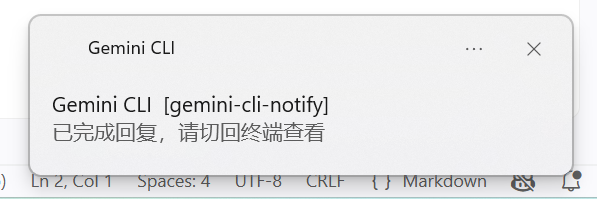

# gemini-cli-notify

[简体中文](README.md) | [English](README_en.md)

A Windows wrapper for [Gemini CLI](https://github.com/google-gemini/gemini-cli) that sends **Windows Toast notifications** when:

- **Gemini needs your confirmation** (e.g. file edits, command execution) — so you can switch back to the terminal
- **Gemini finishes its response** — so you know the output is ready

This is useful when you switch away from the terminal while Gemini is working. You'll get a desktop notification the moment it needs attention.

## How It Works

`gemini-cli-notify` launches `gemini` inside a [ConPTY](https://devblogs.microsoft.com/commandline/windows-command-line-introducing-the-windows-pseudo-console-conpty/) (Windows Pseudo Console) and polls the console title. Gemini CLI updates the title with status icons:

| Icon | Meaning | Notification |
|------|---------|--------------|
| ✋ | Needs user confirmation | "需要你确认操作，请切回终端" |
| ✦ / ⏲ → ◇ | Finished responding | "已完成回复，请切回终端查看" |



## Installation

### From Release

Download the latest `.exe` from the [Releases](https://github.com/jiangwan0130/gemini-cli-notify/releases) page and place it in your `PATH`.

### From Source

```bash
go install github.com/jiangwan0130/gemini-cli-notify@latest
```

> Requires Go 1.23+ and Windows.

## Usage

Use `gemini-cli-notify` as a drop-in replacement for `gemini`:

```bash
gemini-cli-notify "explain this code"
```

All arguments are forwarded to `gemini` directly.

### Tip: Create an alias

Add to your PowerShell profile (`$PROFILE`):

```powershell
Set-Alias gemini gemini-cli-notify
```

## Build

```bash
go build -o gemini-cli-notify.exe .
```

## Requirements

- Windows 10 1809+ (ConPTY support)
- [Gemini CLI](https://github.com/google-gemini/gemini-cli) installed and in `PATH`

## License

[MIT](LICENSE)
